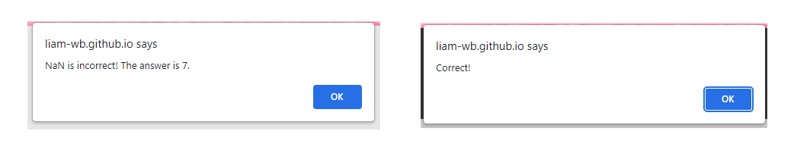

# Quizology

## Portfolio Project 2 Frontend Development Website

This Website is a fully interective and responsive "online studies" resource intended for those looking to test their knowledge in the desired study subject. 
The user will find a simple UX orientated web application incorporating a "flash card" game/quiz, and allowing the user to select which category they would like to be tested on. 

This project is intended for educational purposes only, and not intended for business/professional use. 
The project is built with HTML, CSS and JavaScript to achieve the main goal of making the web application understable and interactive for first-time readers.

## [Live Website Link (GitHub Pages)](liam-wb.github.io/quizology/)
---

# Directory

- [UX Design/Devolopment](https://github.com/Liam-WB/hackney-coffee/blob/main/README.md#ux-designdevelopment)
  - [User goals](#user-goals)
    - [New user goals](#new-user-goals)
    - [Returning user goals](#returning-user-goals)
    - [Website owner business goals](#website-owner-business-goals)
  - [User stories](#user-stories)
  - [Structure of the website](#structure-of-the-website)
  - [Wireframes](#wireframes)
  - [Surface](#surface)
- [Features](https://github.com/Liam-WB/hackney-coffee/blob/main/README.md#features)
- [Technology](https://github.com/Liam-WB/hackney-coffee/blob/main/README.md#technology)
- [Testing](https://github.com/Liam-WB/hackney-coffee/blob/main/README.md#testing)
  - [Functionality testing](#functionality-testing)
  - [Compatibility testing](#compatibility-testing)
  - [Code Validation](#code-validation)
  - [User stories testing](#user-stories-testing)
  - [Issues found during site development](#issues-found-during-site-development)
  - [Performance testing](#performance-testing)
- [Deployment](https://github.com/Liam-WB/hackney-coffee/blob/main/README.md#deployment)
- [Referencing/credit](https://github.com/Liam-WB/hackney-coffee/blob/main/README.md#referencingcredit)
- [Project Screenshots](https://github.com/Liam-WB/hackney-coffee/blob/main/README.md#project-screenshots)

# UX Design/Development

## Key Points

* A welcome/home screen, fitted with visual queues for customers to choose their choice of quiz.
* Four games are available for the user to play.
* A submit button in the game area allows the user to check their answer or compare their answer with the correct one.
* A question and answer area, with contracting colours and UX design, allowing the user to easily know where to navigate to.
* A score area, counting each right and wrong answer submitted by the user.

## Target Audience

* Students.
* Users looking to study/learn new subjects.

## Website Owner Goals

The reason for the creation of this website is to provide the user with a new, entertaining and interactive way of testing their knowledge in their desired topic of studies.
The website owner can present the user with this approach to excercising student's/target user's tuition, as well as allow for opportunities to promote business related content in future updates, such as related study websites and promotional business information and content to create a positive business to customer relationship.
The combination of the website's goals and purpose allow for the development and progression of the target user's education via an interactive web application allowing the user to be thoroughly tested in the topic of their choice.

## User Goals

- User will be greeted by a simple and concise homepage allowing for easy and fluid navigation through the website.
- User can decide between which category they would like to be tested on allowing for specific and effiicient learning.
- User can take a note of their score allowing the user to take note of their level of knowledge in the category.

## Returning User Goals

- User can revisit questions from before and refine their knowledge.
- User is able to test themselves in new categories.
- User can compare new scores to previous scores to monitor progression.

## User stories

### As a business owner

* I would like to create a positive business relationship between the website/business owners and the target customers.
* I need to make sure that my current and new customers are able to nurture and devolp their range of knowledge and education.
* I want my customers to find learning to be fun, simple and easy.
* I would like to build and maintain relationship with potential and current customers.

### As a new customer

* I wish to learn about certain subjects that I'm looking to improve in.
* I want the method of learning to be unique, fun and simple.
* I would like to be able to keep track of my progress and understand my current level within the subject.

### As a returning customer

* I need to be able to continue my progression in learning, and learn new subjects if required.
* I would like to compare my new scores to my old scores.
* I want to be able to easily remember where each feature of the website is and be able to easily navigate to said features.

## Structure of the website

The website is designed to be easy and user-friendy on all type of devices. On desktop, tablet or mobile device there should be no difference for a user to have a fantastic experience. All parts are designed to achieve maximum user satisfaction. The user will get some interaction from the interface as links and buttons will have a hover effects.

Quizology provides users with value by presenting a platform where they can nurture their education, specifically within 4 core subjects maths, history, science and geography.

The quizzes provided, allow the user a unique, interactive and entertaining approach to developing the target user's understanding in the 4 listed categories of study.The quizzes listed above are made with simplicity and efficiency in mind, replicating the effect of "flash cards", meaning that when the user begins the quiz, the application will pick random questions from the handful of specific questions for the user to be tested on. This will allow the users to learn through repition, memorising key points of study for each subject.Through the use of the score section within the game area, the user will be able to take note of how well they're doing and what questions they must improve on.Each question will provide the user with an alert telling them wether their answer is correct, and compare their answer to the correct answer, meaning that the user will be able to improve on their faults and understand their strong-points in the subject quizzes.The website is made for anyone to try as long as they share an interest in testing their knowledge, wether they are new and looking for an informative and interesting appooach to their studies, or a returning user, looking to improve in their studies.

## Design/Style

### Color Scheme

The project consists of a simple color scheme with contrast and high visibility, allowing for easy navigation through the site.

Main colours used in the project:
- background color: #cccaca
- font color: #303030
- game area color: #e7e6e6
- score area colors: #008000, #ff0000

Color pallet was made with [coolors](https://coolors.co/).

### Typography

- As a main font I used Times New Roman, and as a backup I used Times, serif

### Images

- All images used can be found in the [Images Folder](assets/images) of the project.

[Return to directory](#directory)
___

## Wireframes

I used website [wireframe.cc] to create the project wireframes.

[Return to directory](#directory)
___

# Features

### Page structures

The website consists of 5 pages, all accessible from the navigation menu. On the homepage, you can also access the category pages via the icon links.
Page alerts are also implemented depending on interaction from the user. Alerts include correct and incorrect answer messages, as well as unkown data type messages.

The website contains the features listed below:

## Navigation bar

- #### Navigation bar is visible on the top of each website. It is compact and responsive, and will adapt to mobile devices via a change into a burger menu. It also contains a dropdown feature to group and access the categories in one location rather than spread throughout the nav bar.

* Navigation scheme:

  - On left side there is a logo. It can be used as a navigation link to the main page.
  - On right side there are 2 buttons. It contains:
    - Home
    - Categories (Dropdown menu)
      - Maths
      - History
      - Science
      - Geography

  - The buttons also contain a hover effect for visibility, so the user is able to tell which button they will be selecting when clicking on it.

## Home

- ### Landing Page

  - The landing page contains a welcome message to greet new and returning users and guide them to the category selection section in the center of the page.

    

- ### Category Link Icons

  - The icons located in the center of the landing page are images wrapped in an anchor link to each of the 4 categories. They are large and contrast against the main color pallet to easily lead the user to the categories. The formation of these icons will switch to horizontal when the viewport size reaches the small-medium media query range.

    

## Maths, History, Science and Geography Pages

- ### Game Area Section

  - Container for the individual quiz features. All of the JS scripts are focused into the game area, to make the project more organised and easier to navigate the code. The game is changed depending on the category selected and all the variables within the game area change accordingly.

- ### Category Title

  - Large, bold text at the top center of the game area, to indicate which section of the web application the user is on.

- ### Question Area

- Displays a random question out of the list of different strings/operators/integers within the box, responsive for each device type screen size.

- ### Answer Area

  - Displays the answer typed in by the user within the box. Responsive for each device type screen size. The maths input box also contains arrows on the right side to increment the answer one digit up or down.

- ### Score Area

  - This section contains 2 sub-sections: The Right and Wrong sections - These will count and display the number of their respective answers within each category. This section will switch to a more compact version when the viewport reaches a small-medium screen size range.

- ### Submit Button

  - This button calls the alert functions when interacted with by the user. It contains a fade in/out effect for a unique addition to the project.

- ### Alerts

  - The alerts will display when the submit button is interacted with, after an answer has been input. The alert displayed can be "correct" or "incorrect" followed by the correct answer for comparison.

## Favicons

- Text icons located in the categories section of the nav bar. [https://favicon.io/](favicon.io) supplied the scripts to import for this.

## Future implementations

- Increase question range.
- Add a leaderboard.
- Add hint button.
- Login section, about/business info section, or extra section to add to the nav bar.

[Return to directory](#directory)
___
